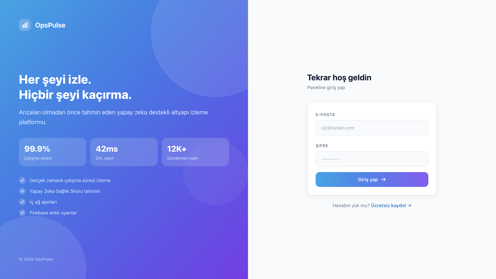
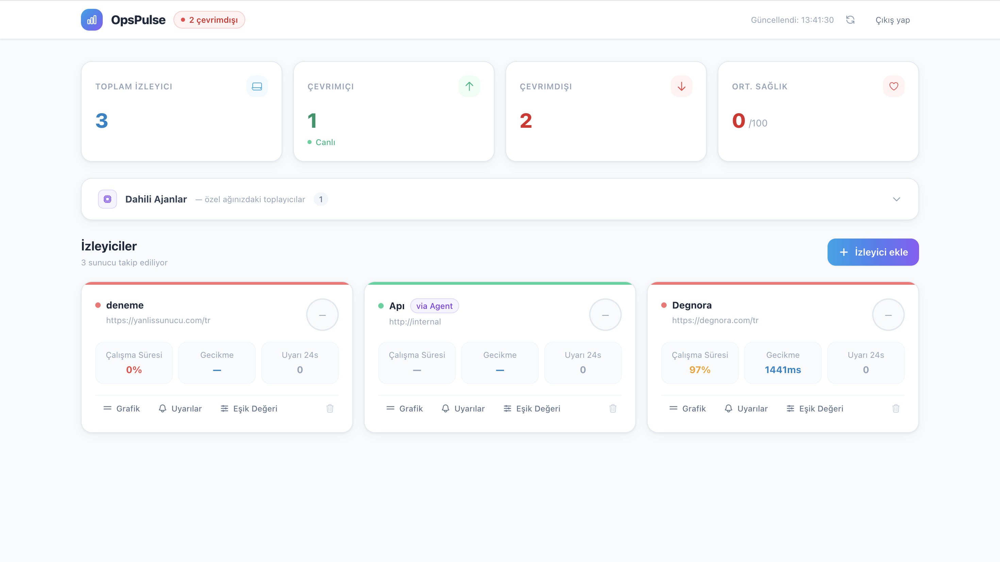
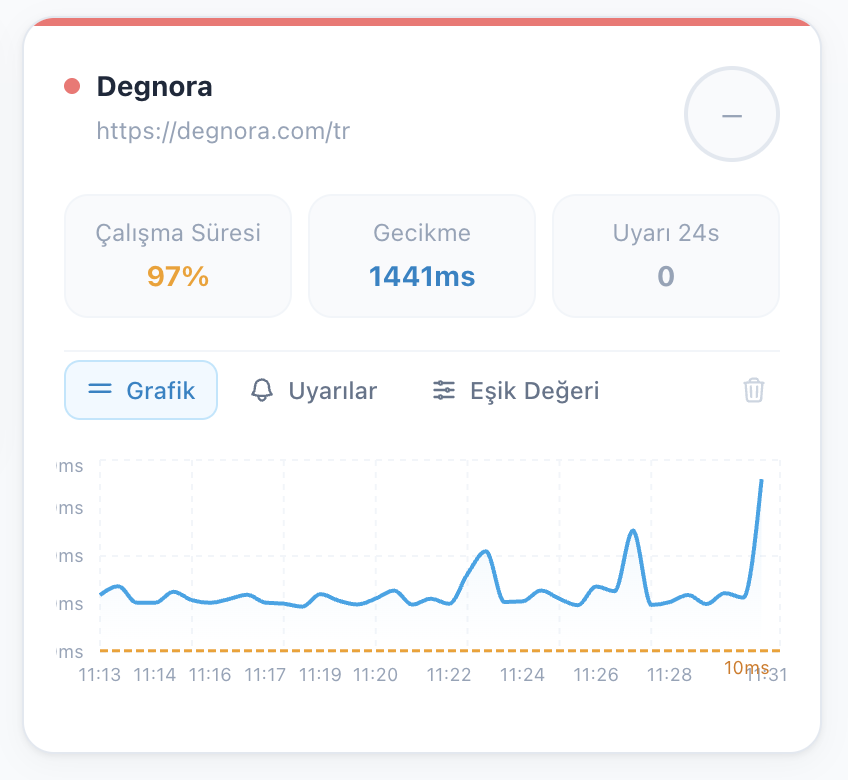
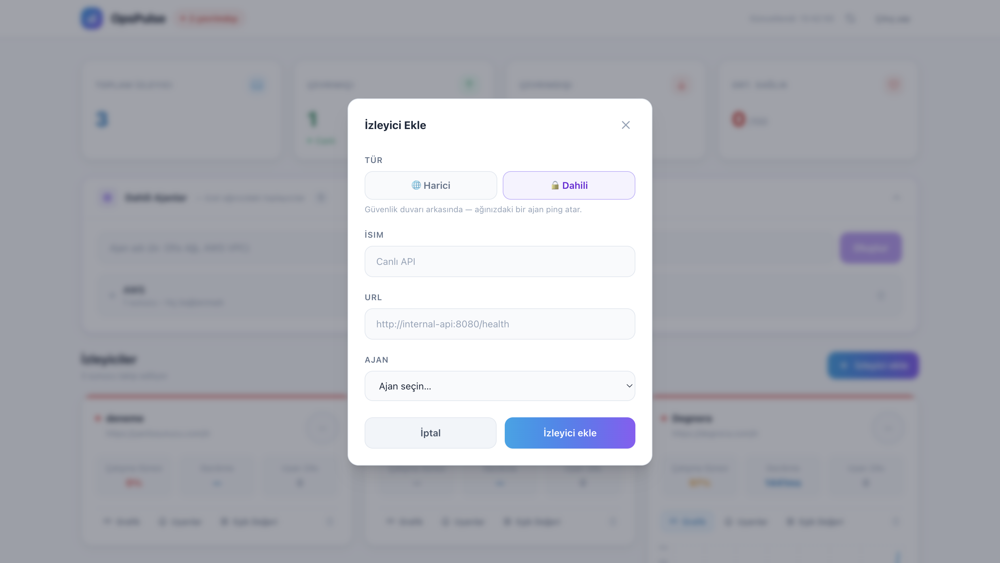
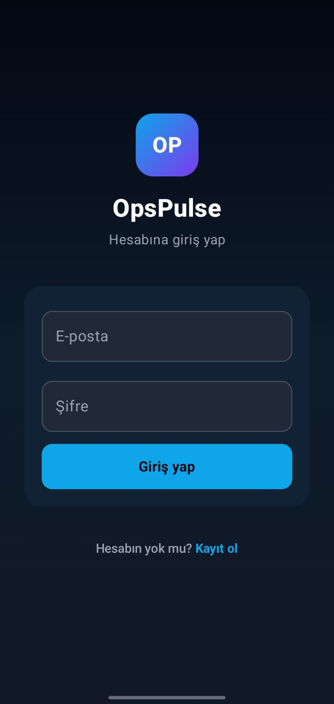
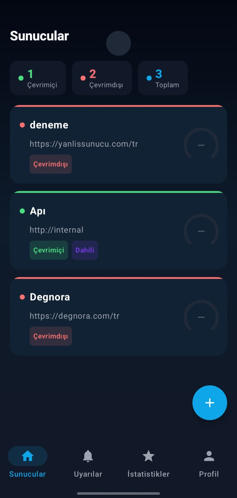
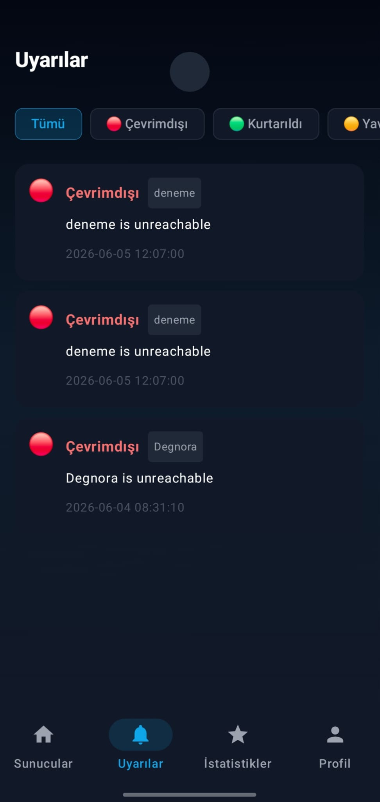
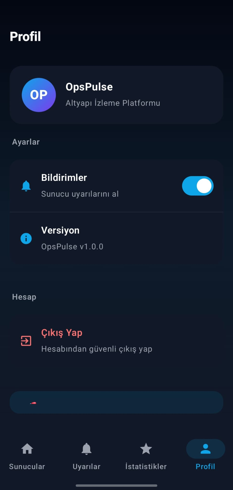
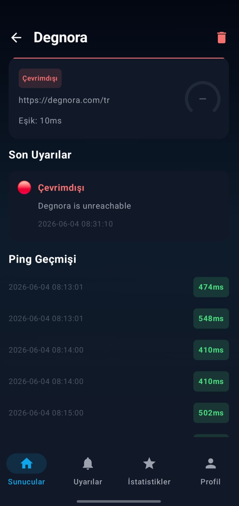

# OpsPulse

> AI destekli sunucu izleme ve erken uyarı platformu

Sunucuların ve API'lerin sağlığını gerçek zamanlı izler, **Lineer Regresyon** ile geçmiş gecikme verilerini analiz ederek arızaları **olmadan önce tahmin eder** ve kritik uyarıları Firebase üzerinden mobil cihazlara gönderir.

---

## Ekran Görüntüleri

### Web Paneli

<table>
  <tr>
    <td align="center"><b>Giriş Ekranı</b></td>
    <td align="center"><b>Kayıt Ekranı</b></td>
    <td align="center"><b>Dashboard</b></td>
  </tr>
  <tr>
    <td></td>
    <td></td>
    <td></td>
  </tr>
  <tr>
    <td align="center"><b>Sunucu Detayı & Gecikme Grafiği</b></td>
    <td align="center"><b>Sunucu Ekle</b></td>
    <td></td>
  </tr>
  <tr>
    <td></td>
    <td></td>
    <td></td>
  </tr>
</table>

### Mobil Uygulama (Android)

<table>
  <tr>
    <td align="center"><b>Giriş</b></td>
    <td align="center"><b>Sunucular</b></td>
    <td align="center"><b>Uyarılar</b></td>
    <td align="center"><b>İstatistikler</b></td>
    <td align="center"><b>Profil</b></td>
    <td align="center"><b>Sunucu Detayı</b></td>
  </tr>
  <tr>
    <td></td>
    <td></td>
    <td></td>
    <td></td>
    <td></td>
    <td></td>
  </tr>
</table>

---

## Mimari

```
Web (React + Nginx :80)
    │
    ▼
Backend (Node.js + Express :3000)
    ├── REST API  (auth, sunucular, metrikler)
    ├── Pinger Motoru  (node-cron, 60s)
    └── AI Servis (Python + FastAPI :8000)
            │
            ▼
       PostgreSQL 16
            │
            ▼
    Firebase Cloud Messaging
            │
            ▼
    Android Uygulaması
```

---

## Teknoloji Yığını

| Katman | Teknoloji |
|---|---|
| Backend | Node.js 20 · Express · TypeScript · Prisma |
| Veritabanı | PostgreSQL 16 |
| AI Sidecar | Python 3.12 · FastAPI · scikit-learn |
| Web | React 18 · Vite · Tailwind CSS · Recharts |
| Mobil | Kotlin · Jetpack Compose · Hilt · Retrofit |
| Bildirim | Firebase Cloud Messaging (FCM) |
| DevOps | Docker Compose · GitHub Actions · GHCR |

---

## Yapay Zeka Nasıl Çalışır?

Her ping döngüsünde (60 sn) backend, son 50 ping verisini AI servisine gönderir:

1. **Lineer Regresyon** ile gecikme trendi hesaplanır
2. Ortalama gecikme, yükselen trend ve jitter → **Sağlık Skoru (0–100)** üretilir
3. 10 ping ilerisi **projeksiyon** yapılır — arıza riski varsa `predictedFailure: true`
4. Skor 40 altına düşerse veya projeksiyon başarısız olursa **FCM bildirimi** gönderilir

---

## Hızlı Başlangıç

```bash
# Tüm servisleri tek komutla başlat (geliştirme)
./start.sh
```

```bash
# Üretim (Docker Compose)
cp .env.example .env        # JWT_SECRET ve POSTGRES_PASSWORD doldur
docker compose up -d --build
```

| Servis | Adres |
|---|---|
| Web | http://localhost |
| Backend API | http://localhost:3000 |
| AI Servisi | http://localhost:8000 |

---

## Yerel Geliştirme

**Backend**
```bash
cd backend && npm install
npx prisma db push
npm run dev
```

**AI Servisi**
```bash
cd ai-service && pip install -r requirements.txt
uvicorn main:app --reload
```

**Web**
```bash
cd web && npm install && npm run dev
```

**Mobil** — `mobile/` klasörünü Android Studio'da aç, Firebase Console'dan `google-services.json` ekle, cihaz veya emülatörde çalıştır.

---

## CI/CD

`main` branch'e her push'ta:

1. **CI** — Backend lint + build + test · AI servis test · Web lint + build (paralel)
2. **CD** — Docker imajları GHCR'a build & push → SSH ile production sunucusuna deploy

Gerekli GitHub Secrets: `SSH_HOST` `SSH_USER` `SSH_PRIVATE_KEY` `JWT_SECRET` `POSTGRES_PASSWORD` `FCM_SERVER_KEY`

---

## Proje Yapısı

```
OpsPulse/
├── backend/        Node.js API + Pinger motoru
├── ai-service/     Python yapay zeka servisi
├── web/            React web paneli
├── mobile/         Kotlin Android uygulaması
├── agent/          Dahili ağ ajanı
├── docs/           Ekran görüntüleri
├── docker-compose.yml
└── start.sh        Tek komutla başlatıcı
```
